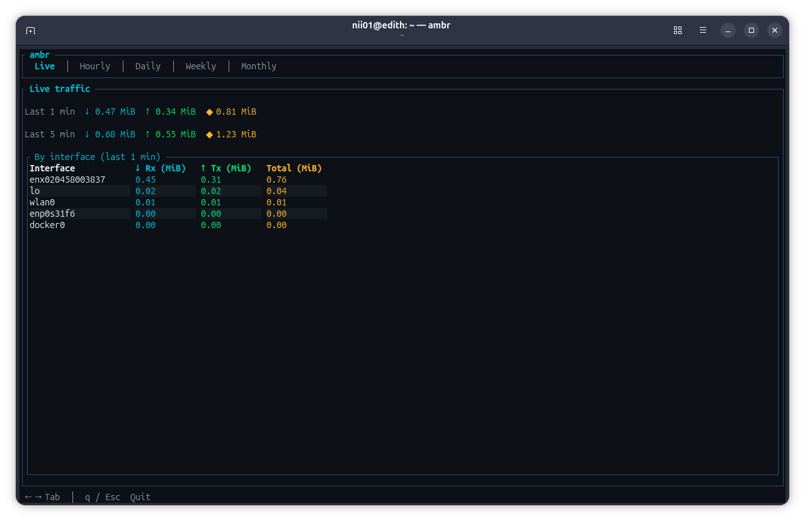
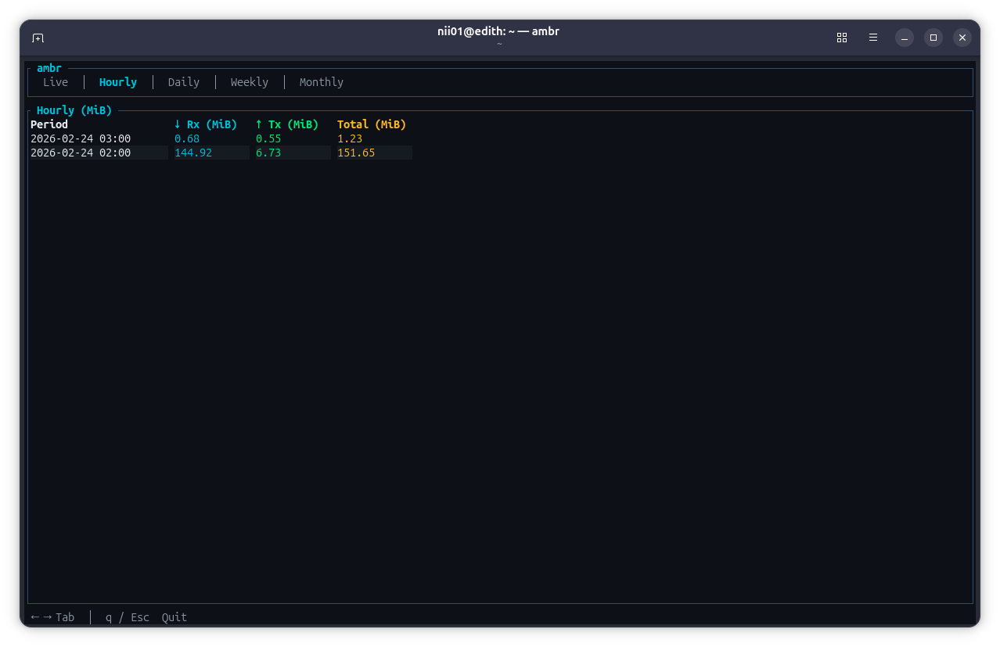
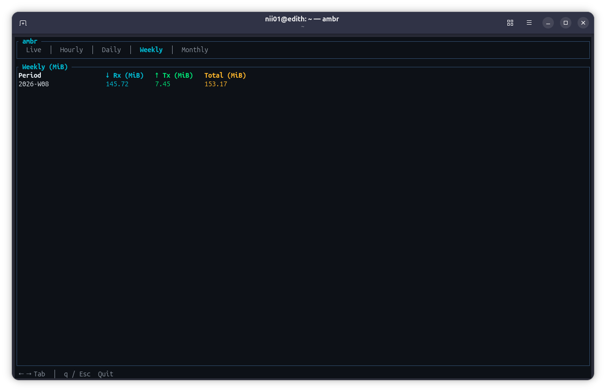
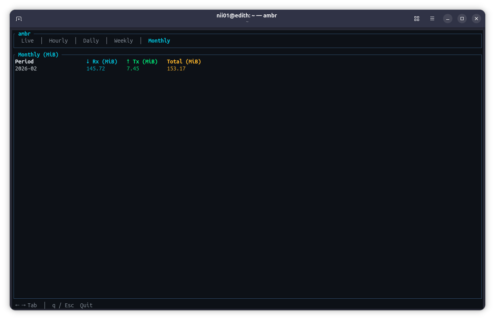

# ambr

A **terminal user interface (TUI)** for monitoring network traffic. It records per-interface usage in the background and shows live and historical data (hourly, daily, weekly, monthly) in MiB, with a networking-style color scheme.

### Screenshots

| Live | Hourly | Daily |
|------|--------|-------|
|  |  |  |

| Weekly | Monthly |
|--------|---------|
|  |  |

---

## Features

- **Live tab** – Real-time traffic for the last 1 and 5 minutes (totals and per-interface). Updates every 1 second while you’re on the Live tab.
- **History tabs** – Aggregated usage in MiB:
  - **Hourly** – Last 24 hours (within 7 days)
  - **Daily** – Last 31 days
  - **Weekly** – Last 12 weeks
  - **Monthly** – Last 12 months
- **Background recording** – A recorder task samples network counters every 10 seconds and stores deltas in SQLite, so history is built automatically.
- **Per-interface breakdown** – Live view includes a table of each interface (e.g. `wlan0`, `eth0`, `lo`) with Rx, Tx, and total MiB.
- **Cross-platform** – Runs on Linux, macOS, and Windows (Rust + `sysinfo` + `crossterm`/`ratatui`).

---

## Requirements

- A terminal (e.g. Linux terminal, macOS Terminal/iTerm2, Windows Terminal, PowerShell).  
- No Rust or other build tools are required if you use the pre-built artifacts (see Installation).

---

## Installation

Download the artifact for your platform from the [Releases](https://github.com/niicommey01/ambr/releases) page, then unpack and run.

| Platform | Artifact | Unpack | Run |
|----------|----------|--------|-----|
| **Linux x86_64** | [`ambr-linux_amd64.tar.gz`](https://github.com/niicommey01/ambr/releases/download/v0.1.0/ambr-linux_amd64.tar.gz) | `tar -xzf ambr-linux_amd64.tar.gz && cd ambr-linux_amd64` | `./ambr` |
| **Linux arm64** (e.g. Raspberry Pi 4) | [`ambr-linux_arm64.tar.gz`](https://github.com/niicommey01/ambr/releases/download/v0.1.0/ambr-linux_arm64.tar.gz) | `tar -xzf ambr-linux_arm64.tar.gz && cd ambr-linux_arm64` | `./ambr` |
| **Windows x86_64** | [`ambr-windows_amd64.zip`](https://github.com/niicommey01/ambr/releases/download/v0.1.0/ambr-windows_amd64.zip) | Unzip, then open a terminal in the folder | `ambr.exe` |
| **macOS Intel** | [`ambr-darwin_amd64.tar.gz`](https://github.com/niicommey01/ambr/releases/download/v0.1.0/ambr-darwin_amd64.tar.gz) | `tar -xzf ambr-darwin_amd64.tar.gz && cd ambr-darwin_amd64` | `./ambr` |
| **macOS Apple Silicon** (M1/M2/M3) | [`ambr-darwin_arm64.tar.gz`](https://github.com/niicommey01/ambr/releases/download/v0.1.0/ambr-darwin_arm64.tar.gz) | `tar -xzf ambr-darwin_arm64.tar.gz && cd ambr-darwin_arm64` | `./ambr` |

The database is stored in a fixed location so you can run `ambr` from any directory:
- **Linux:** `~/.local/share/ambr/ambr.db` (or `$XDG_DATA_HOME/ambr/ambr.db` if set)
- **macOS:** `~/Library/Application Support/ambr/ambr.db`
- **Windows:** `%LOCALAPPDATA%\ambr\ambr.db`

### Install to PATH (optional)

To run `ambr` from anywhere, copy the **binary** (not the folder) into a directory on your PATH:

**Linux / macOS:**

```bash
# Unpack the tarball, then copy only the binary
tar -xzf ambr-linux_amd64.tar.gz
sudo cp ambr-linux_amd64/ambr /usr/local/bin/ambr
sudo chmod +x /usr/local/bin/ambr
```

Then run `ambr` from any directory. You can remove the `ambr-linux_amd64` folder after copying.  
(Use `ambr-linux_arm64/ambr` or `ambr-darwin_*/ambr` for arm64 Linux or macOS.)

**Windows:** Add the folder containing `ambr.exe` to your PATH, or run `ambr.exe` by full path.

---

## Usage

From the folder where you unpacked the artifact (or where the `ambr` / `ambr.exe` binary lives):

```bash
./ambr          # Linux / macOS
ambr.exe       # Windows (in PowerShell or cmd)
```

You can run `ambr` from any directory; the database is stored in your user data directory (see Installation).

### Key bindings

| Key        | Action              |
|-----------|---------------------|
| **Tab** / **→** | Next tab (Live → Hourly → Daily → Weekly → Monthly) |
| **←**     | Previous tab        |
| **q** / **Esc** | Quit              |

The hint bar at the bottom shows: `← → Tab │ q / Esc Quit`.

---

## Tabs and data

- **Live** – Last 1 min and last 5 min totals (Rx ↓, Tx ↑, Total ◆) in MiB, plus a “By interface (last 1 min)” table. Refreshes every **1 second** on this tab.
- **Hourly / Daily / Weekly / Monthly** – Tables with columns: Period, Rx (MiB), Tx (MiB), Total (MiB). Data is refreshed when you switch to the tab (and once at startup).

The recorder runs in the background and writes new samples every **10 seconds**. Live data is derived from these samples; history is aggregated from the same table.

---

## Configuration

- **Database path** – Stored in the user data directory (`~/.local/share/ambr/` on Linux, `~/Library/Application Support/ambr/` on macOS, `%LOCALAPPDATA%\ambr\` on Windows). The app creates the directory on first run.
- **Recording interval** – 10 seconds (hardcoded in `src/main.rs`).
- **Live refresh** – 1 second on the Live tab, 2 seconds when another tab is selected.

---

## For developers

Clone the repo and build from source. Requires [Rust](https://rustup.rs) 1.70+.

```bash
git clone https://github.com/niicommey01/ambr.git
cd ambr
cargo build --release
```

Binary: `target/release/ambr` (or `ambr.exe` on Windows). To install into your PATH: `cargo install --path .`.

### Building release artifacts

Scripts in `scripts/` produce the same artifacts offered in [Releases](https://github.com/niicommey01/ambr/releases).

**Linux (amd64 + arm64)** – from Linux:

```bash
sudo apt install gcc-aarch64-linux-gnu   # Debian/Ubuntu, for arm64
./scripts/build-release-tarballs.sh
```

Output: `dist/ambr-linux_amd64.tar.gz`, `dist/ambr-linux_arm64.tar.gz`. The repo’s `.cargo/config.toml` sets the arm64 linker.

**Windows (amd64)** – from Linux (cross-compile, no Windows needed):

```bash
# Full MinGW toolchain (gcc + binutils including dlltool)
sudo apt install mingw-w64 binutils-mingw-w64-x86-64
./scripts/build-windows.sh
```

Output: `dist/ambr-windows_amd64.zip` (GNU build, no VC++ Redistributable required).

**macOS (Intel + Apple Silicon)** – run on a Mac:

```bash
./scripts/build-darwin.sh
```

Output: `dist/ambr-darwin_amd64.tar.gz`, `dist/ambr-darwin_arm64.tar.gz`. For CI, use a job with `runs-on: macos-latest`.

**Manual:** `cargo build --release` for the current OS; or `rustup target add <target>` then `cargo build --release --target <target>` for other targets. On Windows (MSVC), users may need the [Visual C++ Redistributable](https://learn.microsoft.com/en-us/cpp/windows/latest-supported-vc-redist).

### Development

```bash
cargo build          # debug build
cargo run            # run (debug)
cargo test           # all tests (integration tests in tests/tests.rs)
cargo test --test tests   # integration tests only
cargo fmt
cargo clippy
```

### Project structure

```
ambr/
├── Cargo.toml
├── src/
│   ├── lib.rs       # Library: db + recorder
│   ├── main.rs      # Binary: TUI, key handling, theme
│   ├── db.rs        # SQLite schema, save_delta, usage_by_*, recent_*
│   └── recorder.rs  # Background task: sysinfo → deltas → db
├── tests/
│   └── tests.rs     # Integration tests (in-memory SQLite)
└── scripts/         # Build scripts for release artifacts
```

- **`db`** – Schema (`traffic`: interface, rx_bytes, tx_bytes, timestamp), inserts, and queries for live and aggregated usage.
- **`recorder`** – Reads network interfaces via `sysinfo`, computes deltas, calls `db::save_delta` every 10s.
- **`main`** – Connects to DB, spawns recorder, runs TUI; draws tabs and tables with `ratatui`/`crossterm`.

---

## Tech stack

| Crate     | Purpose                          |
|----------|-----------------------------------|
| **ratatui** + **crossterm** | TUI and terminal control        |
| **sqlx** (SQLite) | Database and async queries      |
| **sysinfo**      | Network interface stats         |
| **tokio**        | Async runtime and background task |
| **chrono**       | Timestamps (via sqlx)           |

---

## License
This project is licensed under the MIT License - see the [LICENSE](LICENSE) file for details.